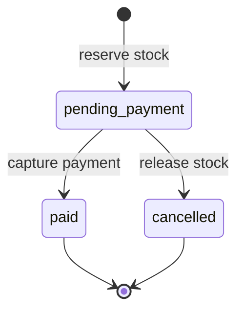

# Commerce Systems Demo

A runnable Amazon-style ordering backend focused on consistency boundaries rather than a
pixel-perfect storefront. It demonstrates the failure-prone part of commerce systems: reserving
inventory, retrying requests, capturing payments and emitting events without corrupting state.

## What works

- atomic inventory reservation with `BEGIN IMMEDIATE` write serialization
- idempotent order creation keyed by the caller's request identifier
- duplicate-line aggregation and price snapshots on order items
- explicit `pending_payment → paid/cancelled` state transitions
- idempotent payment capture and reservation release on cancellation
- transactional outbox events committed with each state transition
- inventory and paid-GMV metrics
- FastAPI endpoints, deterministic CLI demo, Docker and multi-version CI
- a PostgreSQL target schema alongside the self-contained SQLite implementation

## Run it

```bash
python -m venv .venv
. .venv/bin/activate
pip install -e '.[dev]'
pytest
commerce-demo --database demo.db
uvicorn commerce.api:app --reload
```

Open `http://127.0.0.1:8000/docs` for the API contract.

## Order lifecycle



Replaying `POST /orders` with the same idempotency key returns the original order without
reserving stock again. Replaying the same payment identifier also returns the paid order without
decrementing inventory twice.

## API

| Method | Path | Purpose |
|---|---|---|
| `GET` | `/inventory` | stock and available quantities |
| `POST` | `/orders` | create or replay an order |
| `POST` | `/orders/{id}/capture` | capture payment and consume stock |
| `POST` | `/orders/{id}/cancel` | cancel and release reservation |
| `GET` | `/orders/{id}` | order state |
| `GET` | `/metrics` | order count, cancellation count and paid GMV |

SQLite makes the demo reproducible in one process. `sql/schema.sql` documents the corresponding
PostgreSQL model; the repository boundary is where a production adapter would use row locks and
an outbox publisher for Kafka-compatible delivery.
